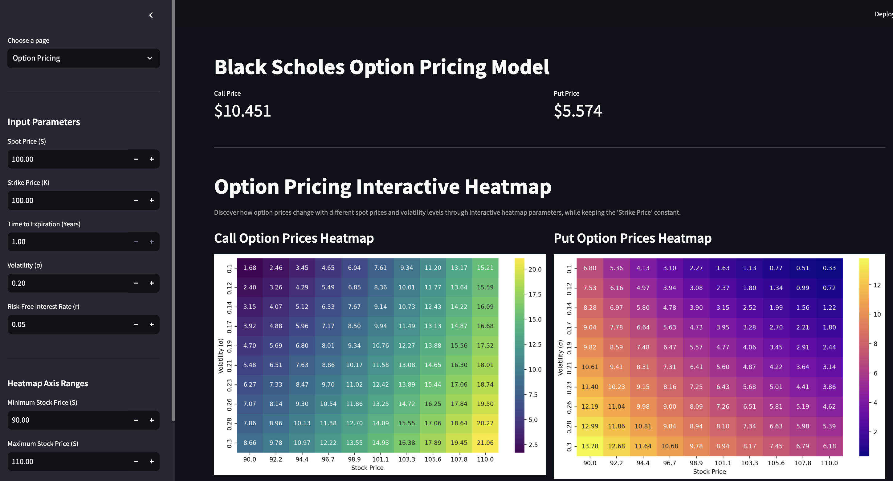
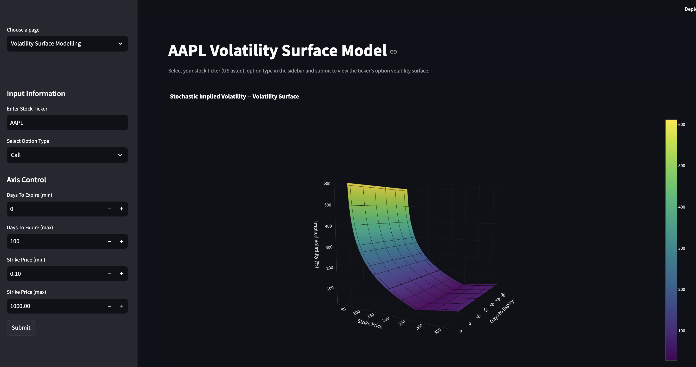

# Quant Trading: Option Pricing and Volatility Surface Model

This project provides tools for analyzing option pricing, visualizing the results through interactive heatmaps and volatility surface model.
## Features

- **Option Pricing**: Calculate the pricing of options with the parameters given.
- **Interactive Heatmaps**: Visualize option pricing data in an intuitive and interactive way.
- **Volatility Surface Model**: Build and visualize a 3D volatility surface to understand the relationship between strike prices, days to expiration, and implied volatility.

### Option Pricing Heatmap

### Volatility Surface Model

